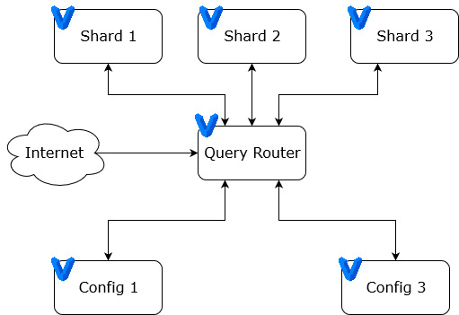
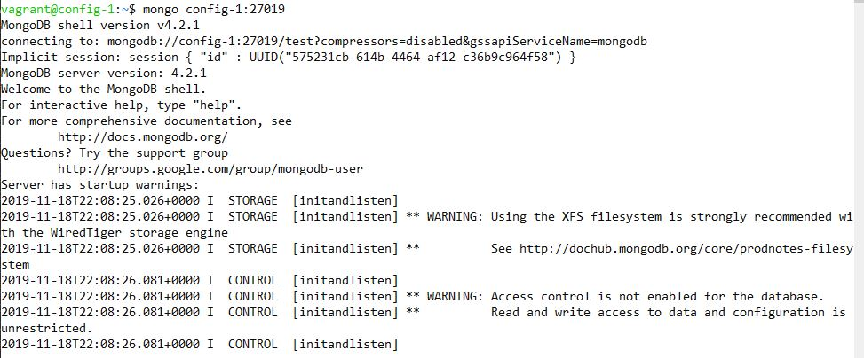
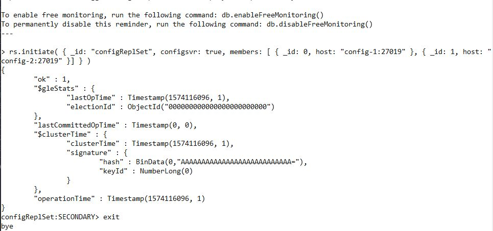
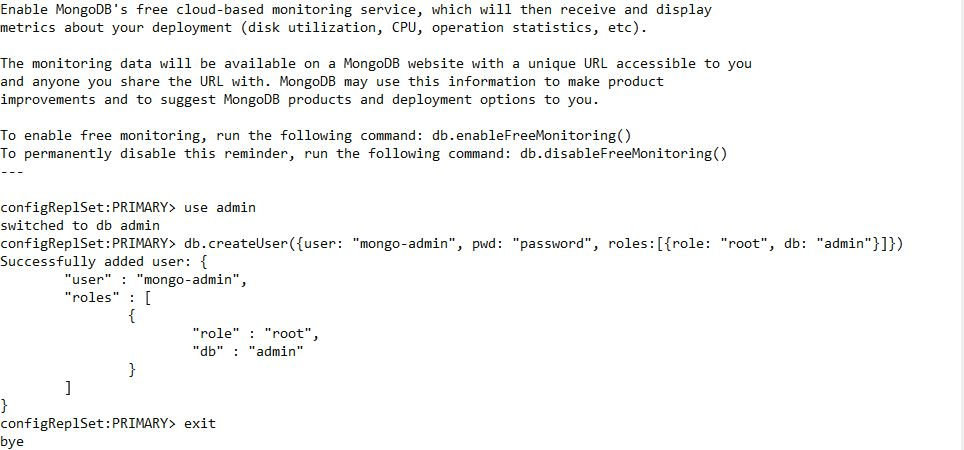
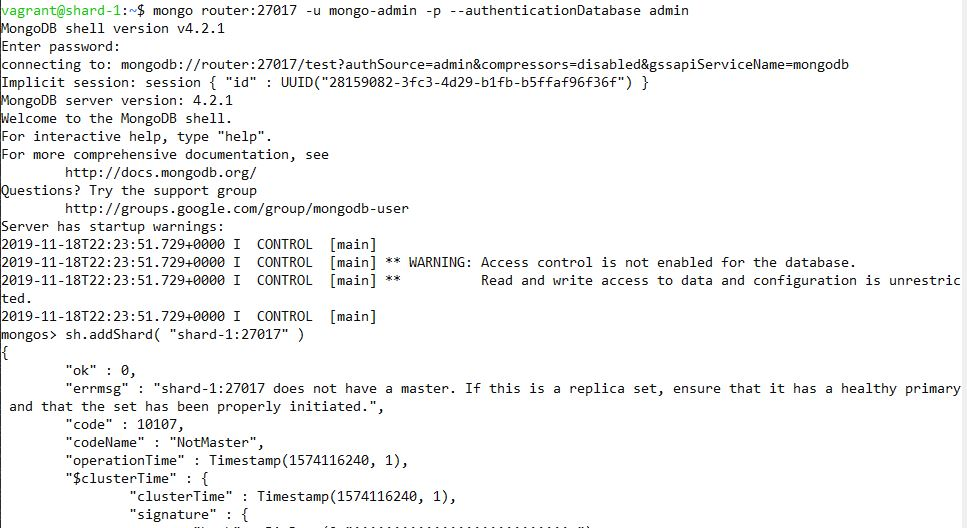
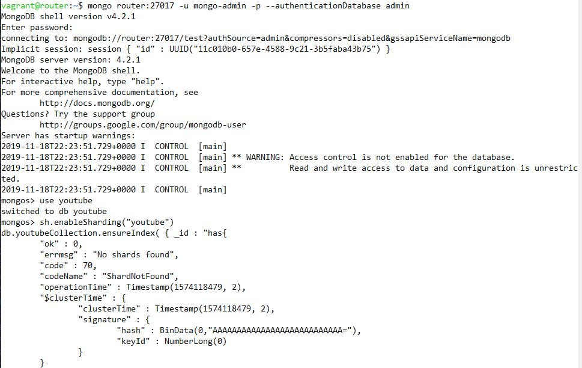

# Sharding MongoDB
 
 Muhammad Aufa Wibowo 05111640000184

# Deskripsi Singkat Tentang MongoDB Sharding
Sharding adalah metode untuk mendistribusikan data di beberapa mesin. MongoDB menggunakan sharding untuk mendukung penyebaran dengan set data yang sangat besar dan operasi throughput yang tinggi.

Sistem basis data dengan kumpulan data besar atau aplikasi throughput tinggi dapat menantang kapasitas satu server. Misalnya, tingkat kueri yang tinggi dapat menghabiskan kapasitas CPU server. Bekerja mengatur ukuran yang lebih besar dari RAM sistem menekankan kapasitas I / O dari drive disk.

Ada dua metode untuk mengatasi pertumbuhan sistem: penskalaan vertikal dan horizontal.

Penskalaan Vertikal melibatkan peningkatan kapasitas server tunggal, seperti menggunakan CPU yang lebih kuat, menambah lebih banyak RAM, atau menambah jumlah ruang penyimpanan. Keterbatasan dalam teknologi yang tersedia dapat membatasi satu mesin dari cukup kuat untuk beban kerja yang diberikan. Selain itu, penyedia berbasis Cloud memiliki langit-langit yang keras berdasarkan konfigurasi perangkat keras yang tersedia. Akibatnya, ada maksimum praktis untuk penskalaan vertikal.

Penskalaan Horizontal melibatkan membagi dataset sistem dan memuat lebih dari beberapa server, menambahkan server tambahan untuk meningkatkan kapasitas sesuai kebutuhan. Sementara kecepatan atau kapasitas keseluruhan dari satu mesin mungkin tidak tinggi, masing-masing mesin menangani subset dari keseluruhan beban kerja, berpotensi memberikan efisiensi yang lebih baik daripada server berkecepatan tinggi berkecepatan tinggi tunggal. Memperluas kapasitas penyebaran hanya membutuhkan penambahan server tambahan sesuai kebutuhan, yang dapat menjadi biaya keseluruhan yang lebih rendah daripada perangkat keras kelas atas untuk satu mesin. Imbalannya adalah meningkatnya kompleksitas dalam infrastruktur dan pemeliharaan untuk penyebaran.

MongoDB mendukung penskalaan horizontal melalui sharding.

# Implementasi Cluster MongoDB
- Menggunakan versi MongoDB 4.2
- Menggunakan virtualisasi Vagrant
- Terdiri dari:
    - 2 config server
    - 3 shard server
    - 1 query router



## Konfigurasi
1. Config Server
   - OS: `bento/ubuntu-18.04`
   - RAM: 1024 MB
   - IP:
     -  `192.168.212.2`
     -  `192.168.212.3`
2. Shard Server
   - OS: `bento/ubuntu-18.04`
   - RAM: 1024 MB
   - IP:
     -  `192.168.212.4`
     -  `192.168.212.5`
     -  `192.168.212.6`
3. Query Router
   - OS: `bento/ubuntu-18.04`
   - RAM: 1024 MB
   - IP:
     -  `192.168.212.7`

# Implementasi
1. Mengkonfigurasi config server
   1. Masuk ke primary config server
        `vagrant ssh mongo_config_1`
   2. Shell
        `mongo mongo-config-1:27019`
    
   3. Masukkan replica set
        `rs.initiate( { _id: "configReplSet", configsvr: true, members: [ { _id: 0, host: "mongo-config-1:27019" }, { _id: 1, host: "mongo-config-2:27019" }] } )`
        
    4. Cek status
   ```json
    configReplSet:PRIMARY> rs.status()
    {
    "set" : "configReplSet",
    "date" : ISODate("2019-11-21T22:00:54.649Z"),
    "myState" : 1,
    "term" : NumberLong(1),
    "syncingTo" : "",
    "syncSourceHost" : "",
    "syncSourceId" : -1,
    "configsvr" : true,
    "heartbeatIntervalMillis" : NumberLong(2000),
    "majorityVoteCount" : 2,
    "writeMajorityCount" : 2,
    "optimes" : {
            "lastCommittedOpTime" : {
                    "ts" : Timestamp(1574373644, 2),
                    "t" : NumberLong(1)
            },
            "lastCommittedWallTime" : ISODate("2019-11-21T22:00:44.800Z"),
            "readConcernMajorityOpTime" : {
                    "ts" : Timestamp(1574373644, 2),
                    "t" : NumberLong(1)
            },
            "readConcernMajorityWallTime" : ISODate("2019-11-21T22:00:44.800Z"),
            "appliedOpTime" : {
                    "ts" : Timestamp(1574373644, 2),
                    "t" : NumberLong(1)
            },
            "durableOpTime" : {
                    "ts" : Timestamp(1574373644, 2),
                    "t" : NumberLong(1)
            },
            "lastAppliedWallTime" : ISODate("2019-11-21T22:00:44.800Z"),
            "lastDurableWallTime" : ISODate("2019-11-21T22:00:44.800Z")
    },
    "lastStableRecoveryTimestamp" : Timestamp(1574373644, 2),
    "lastStableCheckpointTimestamp" : Timestamp(1574373644, 2),
    "electionCandidateMetrics" : {
            "lastElectionReason" : "electionTimeout",
            "lastElectionDate" : ISODate("2019-11-21T20:28:36.036Z"),
            "termAtElection" : NumberLong(1),
            "lastCommittedOpTimeAtElection" : {
                    "ts" : Timestamp(0, 0),
                    "t" : NumberLong(-1)
            },
            "lastSeenOpTimeAtElection" : {
                    "ts" : Timestamp(1574368104, 1),
                    "t" : NumberLong(-1)
            },
            "numVotesNeeded" : 2,
            "priorityAtElection" : 1,
            "electionTimeoutMillis" : NumberLong(10000),
            "numCatchUpOps" : NumberLong(1498562884),
            "newTermStartDate" : ISODate("2019-11-21T20:28:36.978Z"),
            "wMajorityWriteAvailabilityDate" : ISODate("2019-11-21T20:28:37.869Z")
    },
    "members" : [
            {
                    "_id" : 0,
                    "name" : "mongo-config-1:27019",
                    "ip" : "192.168.212.2",
                    "health" : 1,
                    "state" : 1,
                    "stateStr" : "PRIMARY",
                    "uptime" : 8624,
                    "optime" : {
                            "ts" : Timestamp(1574373644, 2),
                            "t" : NumberLong(1)
                    },
                    "optimeDate" : ISODate("2019-11-21T22:00:44Z"),
                    "syncingTo" : "",
                    "syncSourceHost" : "",
                    "syncSourceId" : -1,
                    "infoMessage" : "",
                    "electionTime" : Timestamp(1574368116, 1),
                    "electionDate" : ISODate("2019-11-21T20:28:36Z"),
                    "configVersion" : 1,
                    "self" : true,
                    "lastHeartbeatMessage" : ""
            },
            {
                    "_id" : 1,
                    "name" : "mongo-config-2:27019",
                    "ip" : "192.168.212.3",
                    "health" : 1,
                    "state" : 2,
                    "stateStr" : "SECONDARY",
                    "uptime" : 5549,
                    "optime" : {
                            "ts" : Timestamp(1574373644, 2),
                            "t" : NumberLong(1)
                    },
                    "optimeDurable" : {
                            "ts" : Timestamp(1574373644, 2),
                            "t" : NumberLong(1)
                    },
                    "optimeDate" : ISODate("2019-11-21T22:00:44Z"),
                    "optimeDurableDate" : ISODate("2019-11-21T22:00:44Z"),
                    "lastHeartbeat" : ISODate("2019-11-21T22:00:53.035Z"),
                    "lastHeartbeatRecv" : ISODate("2019-11-21T22:00:54.252Z"),
                    "pingMs" : NumberLong(1),
                    "lastHeartbeatMessage" : "",
                    "syncingTo" : "mongo-config-1:27019",
                    "syncSourceHost" : "mongo-config-1:27019",
                    "syncSourceId" : 0,
                    "infoMessage" : "",
                    "configVersion" : 1
            }
    ],
    "ok" : 1,
    "$gleStats" : {
            "lastOpTime" : Timestamp(0, 0),
            "electionId" : ObjectId("7fffffff0000000000000001")
    },
    "lastCommittedOpTime" : Timestamp(1574373644, 2),
    "$clusterTime" : {
            "clusterTime" : Timestamp(1574373644, 2),
            "signature" : {
                    "hash" : BinData(0,"AAAAAAAAAAAAAAAAAAAAAAAAAAA="),
                    "keyId" : NumberLong(0)
            }
    },
    "operationTime" : Timestamp(1574373644, 2)
    }
   ```
2. Menambah shard server ke cluser
   1. Keluar dari `SECONDARY`
   `exit`
   1. Gunakan db `admin`
   `use admin`
       
   1. Membuat user
   `db.createUser({user: "mongo-admin", pwd: "password", roles:[{role: "root", db: "admin"}]})`
3. Menambah shard ke dalam Cluster
   1. Masuk ke mongo_shard_1
   `vagrant ssh mong_shard_1`
   1. Hubungkan dengan Query Router
   `mongo router:27017 -u mongo-admin -p --authenticationDatabase admin`
       
   1. Tambahkan shard
   ```
    sh.addShard( "shard-1:27017" )
    sh.addShard( "shard-2:27017" )
    sh.addShard( "shard-3:27017" )
   ```
    
4. Mengaktifkan sharding
    1. Masuk ke router
   `vagrant ssh router`
    1. Connect ke MongoDB
   `mongo router:27017 -u mongo-admin -p --authenticationDatabase admin`
       
    1. Buat collection di mongodb

# Import Dataset
- Sumber https://www.kaggle.com/datasnaek/youtube-new

# Implementasi Aplikasi CRUD


